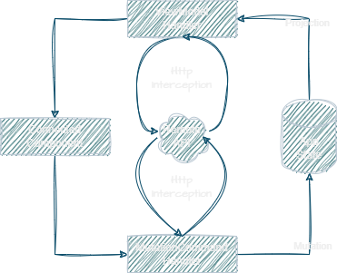

<div align="center">
	
</div>

# Carlton.Core.Flux

<div align="center">
	
</div>  
<br/>

The `Carlton.Core.Flux` is a powerful tool for managing state in your .NET applications. Built on the principles of the Flux architecture, it provides a robust solution for handling state changes in complex applications.


## Key Features

- **Single State Store:** Centralizes application state management, making it easier to maintain and debug.

- **Connected Components:** Components are connected to the state store, allowing them to automatically update when the state changes.

- **ViewModels from State:** Components fetch ViewModel data directly from the state store, eliminating the need for complex data fetching logic.

- **State Mutation Commands:** Easily mutate the state store with commands, keeping state changes organized and predictable.

- **Remote Server Interaction:** Intercept ViewModel queries and mutation commands to interact with a remote server, enabling seamless integration with backend services.

## Dependencies

* Carlton.Core.Foundation.Web

## Getting Started

### Installing

```bash
dotnet add package Carlton.Core.Flux
```
## Usage

### Register Flux Service

```cs
   var state = new AppState();
   builder.Services.AddCarltonFlux(state, opt =>
   {
      opt.AddLocalStorage = true;
      opt.AddHttpInterception = true;
   }); 
```

### Required Implementations

#### ViewModel
The CustomerViewModel class represents the data structure for displaying customer information in your application's user interface. It typically includes properties such as the customer's ID, name, and email address. The ViewModel objects are pocos and require no special interfaces.

```cs
public class CustomerViewModel
{
	public Id int { get; set; }
	public string Name { get; set; }
	public string Email { get; set; }
}
```
#### Command
The ChangeNameCommand class encapsulates the action of changing a customer's name. This command is triggered when a user interacts with the application, such as clicking a button to update the customer's name. The command objects are pocos
and require no special interfces.
```cs
public class ChangeNameCommand
{
	public string NewName { get; set; }
}
```
#### Mutation
The UpdateCustomerMutation class represents a mutation operation in the Flux framework. It implements the `IFluxStateMutation` interface, which species the state event associated with the mutation and a function indicating how the state should be mutated by the command. The mutation should be a pure function, meaning that the mutation method should only rely on its input parameters (the raised command and existing state) to generate a new state object and should not have any side effects. In this example, we are adding a new customer to the list of customers in the application state. This adherence to pure function principles ensures predictable and maintainable state management within the Flux architecture.
```cs
public class UpdateCustomerMutation : IFluxStateMutation<MyState, AddCustomerCommand>
{
    public string StateEvent => "CustomerAdded";

    public AppState Mutate(AppState currentState, AddCustomerCommand command)
    {
    	var updatedCustomerList = CurrentState.Customers.ToList();
	updatedCustomerList.Add(command.NewCustomer);
	return currentState = AppState with
	{
		Customers = updatedCustomerList
	};
    }
}
```
#### ProjectionMapper
The AppStateViewModelMapper class serves as a ViewModel projection mapper in the Flux framework. It implements the `IViewModelProjectionMapper` interface, responsible for mapping the application state to specific ViewModel types. In this example, we are making use of the Mapperly library to generate the mappings automatically but any library or implementatino could be used to achieve the prjoectinos.

```cs
public partial class AppStateViewModelMapper : IViewModelProjectionMapper<AppState>
{
    public partial TViewModel Map<TViewModel>(LabState state);

    [MapProperty(nameof(AppState.SelectedCustomer), nameof(CustomerViewModel))]
    public partial static ChangeNameCommand AppStateToCustomerViewModelProjection(AppState state);
}
```

### Connected Component
The component is a user constructed blazor component, inheriting from `BaseConnectedComponent` that renders the CustomerViewModel data and triggers state change commands. In this example, the component displays the customer's ID, name, and email, and provides a button to raise a ChangeNameCommand that will result in an AppState mutation. It observes the "CustomerUpdated" state event, ensuring that this component will automatically when this event is raised. 

```cshtml
@attribute [FluxViewModelServerUrl("http://test.carlton.com/Customers/{CustomerId}")]
@attribute [FluxCommandServerUrl<ChangeNameCommand>("http://test.carlton.com/Customers/{CustomerId}", HttpVerb.POST)]
@attribute [ObserveStateEvent("CustomerUpdated")]
@inherits BaseConnectedComponent<CustomerViewModel>

<div>
	<span>Id: @ViewModel.Id</span>
	<span>Name: @ViewModel.Name</span>
	<span>Email: @ViewModel.Email</span>
	<button @onclick="base.OnComponentEvent(new ChangeNameCommand(\"Steve Rodgers\"))"></button>
</div>

@code{
	[Parameter, FluxServerUrlParameter]
	public int CustomerId {get; set;}
}
```
##### Flux attributes:

**FluxViewModelServerUrl:** Specifies the URL for fetching ViewModel data from the server during the HTTP interception phase of the flux request. The interception occurrs before the projection and updates the store with the resposne from the server ensuring that the view model projection returns the latest data.
```cshtml
@attribute [FluxViewModelServerUrl("http://test.carlton.com/Customers/{CustomerId}")]
```
**FluxCommandServerUrl:** Specifies the URL and HTTP verb for sending mutation commands to the server. The interception occurrs before the projection and the command is updated with the resposne from the server ensuring that the command contains any server dependent values like database generated seeds or identifiers.
```cshtml
@attribute [FluxCommandServerUrl<ChangeNameCommand>("http://test.carlton.com/Customers/{CustomerId}", HttpVerb.POST)]
```
**FluxServerUrlParameter**: Indicates that the component property is used in the URL patterns specified by FluxViewModelServerUrl and FluxCommandServerUrl.
```cs
[FluxServerUrlParameter]
public int CustomerId {get; set;}
```
**ObserveStateEvent:** Indicates that this component should observe the "CustomerUpdated" state event. When this event is raised, the component automatically updates its content.
```cshtml
@attribute [ObserveStateEvent("CustomerUpdated")]
```
## Authors

Contributors names and contact info

Nicholas Galazzo  
nicholas.galazzo@gmail.com

Stephen Galazzo  
Stephen.Galazzo@gmail.com

