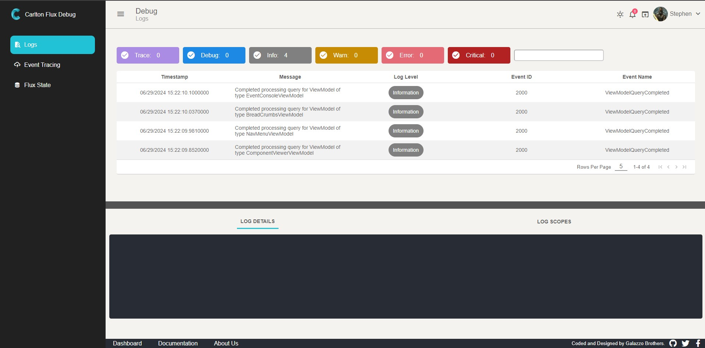

<div align="center">
	
</div>

# Carlton Flux Debug (Carlton.Core.Flux.Debug)

<div align="center">
	
</div>  
<br/>


The `Carlton.Core.Flux.Debug` repository houses a powerful framework designed to facilitate the rendering of Blazor components in isolation. This framework allows developers to interactively work with Blazor components, capture events, modify parameters via JSON text, and visualize the rendered HTML markup of the components. It provides an efficient environment for component development, testing, and experimentation.


## Key Features

- **Component Rendering in Isolation**: Render Blazor components independently to isolate and focus on their behavior and appearance.

- **Interactive Component Interaction**: Interact with rendered components in real-time to observe their behavior and responsiveness.

- **Event Capture**: Capture events generated by the components to analyze their behavior and trigger specific actions.

- **Parameter Modification**: Modify component parameters using JSON text to observe their impact on component rendering and behavior.

- **HTML Markup Visualization**: View the rendered HTML markup of the components to understand their structure and styling.

## Dependencies

* Carlton.Core.Foundation.Web
* Carlton.Core.Components.Layouts
* Carlton.Core.Lab.Models

## Getting Started

### Installing

```bash
dotnet add package Carlton.Core.Lab
```
## Usage

### Register Lab Service

```cs
 	builder.Services.AddCarltonTestLab(builder =>
	{
		builder.AddComponent<Spinner>()
		       .AddComponentState<Checkbox>("Checked", CheckboxTestStates.CheckedState)
                       .AddComponentState<Checkbox>("Unchecked", CheckboxTestStates.UncheckedState)
		       .AddComponentState<Dropdown<int>>("Default", DropdownTestStates.Default)
                       .AddComponentState<Dropdown<int>>("Disabled", DropdownTestStates.Disabled)
                       .AddComponentState<Dropdown<int>>("Pristine", DropdownTestStates.Pristine)
                       .Build();
	});

```

```cs
internal static class CheckboxTestStates
{
    public static object CheckedState
    {
        get => new
        {
            IsChecked = true
        };
    }

    public static object UncheckedState
    {
        get => new
        {
            IsChecked = false
        };
    }
}

```
## Authors

Contributors names and contact info

Nicholas Galazzo  
nicholas.galazzo@gmail.com

Stephen Galazzo  
Stephen.Galazzo@gmail.com

